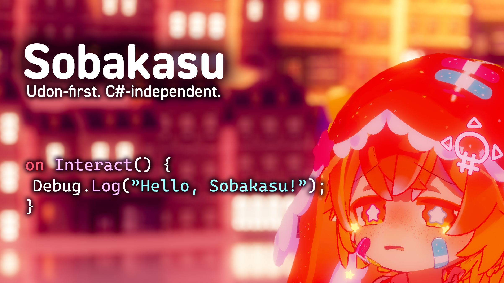

# Sobakasu

Sobakasu は、VRChat の Udon VM 上で動作するプログラムを生成するために設計された、C#に依存しない高級言語及びシステムです。



## 設計思想

* VRChat の Udon VM 上で動作するプログラムを生成するために設計されている (Udon-first)
* C# 文法の制約にとらわれず、Udon の特性に最適化された言語設計 (C#-independent)
* Unity Editor との密接な統合

### 非目標

* C#完全互換
* 汎用プログラミング言語

## はじめ方

1. <https://skytomo221.com/Sobakasu> からVCCを追加する
2. プロジェクトに Sobakasu を追加する
3. `.sobakasu` ファイルを作成
4. コードを書く
5. Unity Project ウィンドウで右クリックして Create -> VRChat -> Udon -> Sobakasu Program Asset を選択
6. Sobakasu Program Asset に作成した `.sobakasu` ファイルを割り当てる
7. Sobakasu Program Asset のインスペクターにある「Compile (Sobakasu -> UASM)」ボタンを押して、UASM が生成させる
8. UdonSharpと同様に、必要なオブジェクトに Udon Behaviour をアタッチし、Sobakasu Program Asset を割り当てる

## 例

```sobakasu
on Interact() {
  Debug.Log("Hello, world!");
}
```

このコードはコンパイル後に VRChat 上で実行されます。
以下のUdonSharpコードと同等の機能を提供します。

```csharp
using UdonSharp;
using UnityEngine;

public class HelloWorld : UdonSharpBehaviour
{
    public override void Interact()
    {
        Debug.Log("Hello, world!");
    }
}
```

## 機能（現状）

> [!NOTE]
> Sobakasuは現在開発中のため、実用的な利用にはまだ向いていません。

* `Debug.Log()` のサポート
* `on Interact()` イベントハンドラのサポート
* `let x = 1;` のような変数宣言
  * `let mut x = 1;` のようなミュータブル変数宣言もサポート済み
* 複数のプリミティブ型
  * `bool`
  * `i8`
  * `u8`
  * `i16`
  * `u16`
  * `i32`
  * `f32`
  * `i64`
  * `u64`
  * `f64`
  * `char`
  * `string`

## ロードマップ

今後優先的に追加される機能は以下の通りです。

* 制御構文（`if`など）
* `Interact()`以外のイベントハンドラの追加
* `Debug.Log()`以外のC#のクラス・関数呼び出し

## アーキテクチャ

Sobakasu は段階的なコンパイラパイプラインを採用しています。

```txt
Lexer
↓
Parser
↓
Binder
↓
Desugar
↓
IR (CFG + Three-Address Code)
↓
Optimizer
↓
UASM
```

この構造により：

* Udon の制約がフロントエンドに漏れない
* 最適化の余地を確保できる
* デバッグがしやすい

Sobakasu は「既存言語をUdonに適応する」のではなく、
**Udonのために最初から設計された言語**です。
