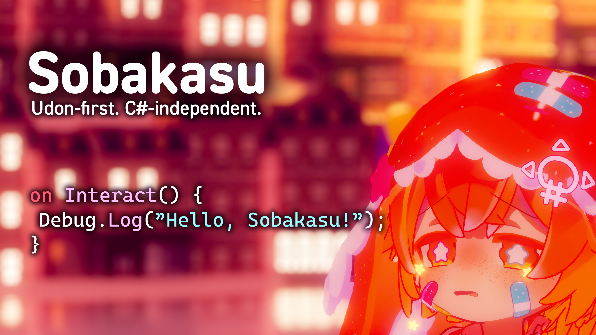

# Sobakasu

Sobakasu は、VRChat の Udon VM 上で動作するプログラムを生成するために設計された、C#に依存しない高級言語及びシステムです。



## 設計思想

* VRChat の Udon VM 上で動作するプログラムを生成するために設計されている (Udon-first)
* C# 文法の制約にとらわれず、Udon の特性に最適化された言語設計 (C#-independent)
* Unity Editor との密接な統合

### 非目標

* C#完全互換
* 汎用プログラミング言語

## はじめ方

1. <https://skytomo221.com/Sobakasu> からVCCを追加する
2. プロジェクトに Sobakasu を追加する
3. Unity プロジェクト内に `.sobakasu` ファイルを作成する
4. コードを書いて保存する（Unity が自動的に import・compile する）
5. 必要なオブジェクトに Udon Behaviour をアタッチする
6. Project ウィンドウの `.sobakasu` ファイルを Udon Behaviour の Program Source に割り当てる

## 例

### Hello World

```sobakasu
on interact {
  log("Hello, world!");
}
```

このコードはコンパイル後に VRChat 上で実行されます。
以下のUdonSharpコードと同等の機能を提供します。

```csharp
using UdonSharp;
using UnityEngine;

public class HelloWorld : UdonSharpBehaviour
{
    public override void Interact()
    {
        Debug.Log("Hello, world!");
    }
}
```

### Fizz Buzz

```sobakasu
state count = 1;

on interact {
  if count % 3 == 0 && count % 5 == 0 {
    log("FizzBuzz");
  } else if count % 3 == 0 {
    log("Fizz");
  } else if count % 5 == 0 {
    log("Buzz");
  } else {
    log(count);
  }
  count += 1;
}
```

このコードはコンパイル後に VRChat 上で実行されます。
以下のUdonSharpコードと同等の機能を提供します。

```csharp
using UdonSharp;
using UnityEngine;

public class FizzBuzz : UdonSharpBehaviour
{
    private int count = 1;

    public override void Interact()
    {
        count++;
        if (count % 3 == 0 && count % 5 == 0)
        {
            Debug.Log("FizzBuzz");
        }
        else if (count % 3 == 0)
        {
            Debug.Log("Fizz");
        }
        else if (count % 5 == 0)
        {
            Debug.Log("Buzz");
        }
        else
        {
            Debug.Log(count);
        }
    }
}
```

### Send Custom Event

```sobakasu
on interact() {
  send event to all;
}

receive event {
  log("Received event!");
}
```

このコードはコンパイル後に VRChat 上で実行されます。
以下のUdonSharpコードと同等の機能を提供します。

```csharp
using UdonSharp;
using UnityEngine;
using VRC.Udon.Common.Interfaces;

public class Example : UdonSharpBehaviour
{
    public override void Interact()
    {
        SendCustomNetworkEvent(NetworkEventTarget.All, nameof(Event));
    }

    public void Event()
    {
        Debug.Log("Received event!");
    }
}
```

## 機能（現状）

> [!NOTE]
> Sobakasuは現在開発中のため、実用的な利用にはまだ向いていません。

* Udon公開APIを扱う `extern` と外部型binding
* Udon API bindingの自動生成と標準ライブラリ
* `use`、Prelude、re-exportを含むモジュールシステム
* UdonSharp互換イベントハンドラ
* Custom Network Eventの宣言・送受信
* `let`、`const`、`state` によるローカル変数・定数・永続状態
  * `pub` と `sync` によるUdon公開・同期
* 関数宣言、関数・メソッドのoverload
* 配列、tuple、`struct`、payload付き `enum`
* generic型とcompile-time monomorphization
* `Maybe<T>` によるnullable値の表現
* `match` とpattern matching
* 基本的な演算子と制御フロー

## ロードマップ

今後優先的に追加・拡充される機能は以下の通りです。

* 標準ライブラリとUdon APIカバレッジの拡充
* 標準ライブラリの正式な公開ルート設計
* ユーザーモジュール／パッケージの登録・解決
* generic機能の拡張
* indexer／extension methodの外部API対応
* ドキュメント・APIリファレンスの整備
* 実際のVRChat／ClientSim上での動作確認・互換性検証
* コンパイラ・標準ライブラリのテストと回帰検証の拡充
* エディタ・診断・デバッグ体験の改善

## アーキテクチャ

Sobakasu は段階的なコンパイラパイプラインを採用しています。

```txt
Lexer
↓
Parser
↓
Binder
↓
Desugar
↓
IR (CFG + Three-Address Code)
↓
Optimizer
↓
UASM
```

この構造により：

* Udon の制約がフロントエンドに漏れない
* 最適化の余地を確保できる
* デバッグがしやすい

Sobakasu は「既存言語をUdonに適応する」のではなく、
**Udonのために最初から設計された言語**です。
